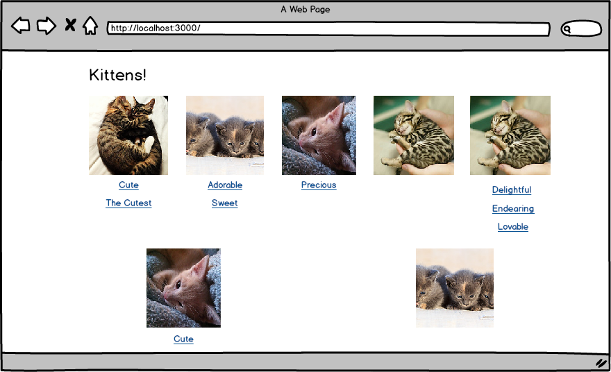
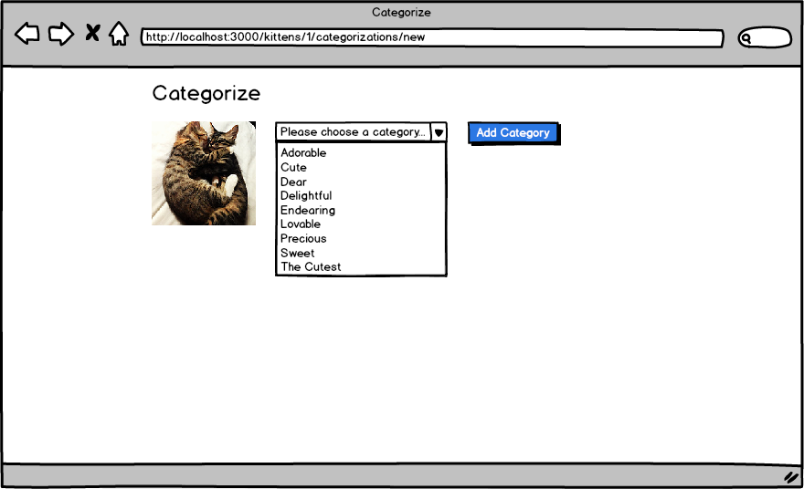
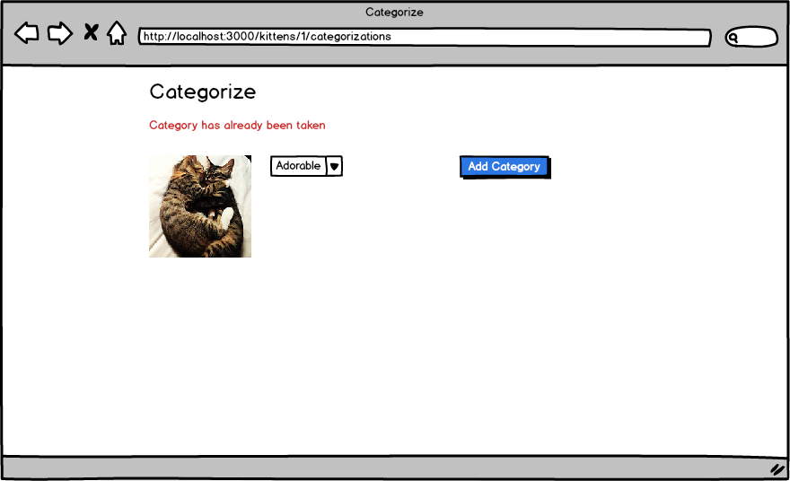

# Rails Practice

## Setup

* `bundle`
* `rake db:create db:migrate db:seed`
* `rails s`

You can run specs with:

* `rspec`

Note: email/password combinations for existing users populated by `rake db:seed` can be found in the db/seeds.rb file.

## Stories

You have kittens.  You have categories.  You *must* categorize kittens.

**Users can add categories to kittens**

```
When I click on the image of a kitten
Then I should see a form where I can add a category to a kitten
And when I select a category and click "Add Category"
Then I should see the category appear underneath the kitten
And categories should appear in alphabetical order
```

**Users must enter a category when categorizing kittens**

```
When I try to add a category
And I leave the category blank
Then I should see a validation message that the category can't be blank
```

**Users should not be able to add the same category twice**

```
When I try to add a category the second time to the same kitten
Then I should see a validation message that the categorization has already been taken
```


## Wireframes

**Index**



**Add Category to Kitten**



**Validation Message**



## References

* [has_many :through association](http://guides.rubyonrails.org/association_basics.html#the-has-many-through-association)
* [collection_select](http://api.rubyonrails.org/classes/ActionView/Helpers/FormOptionsHelper.html#method-i-collection_select)